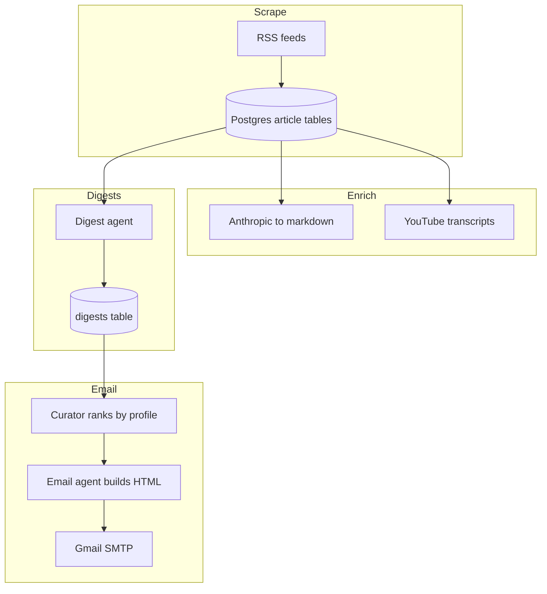

# My personal AI News Aggregator

This is my personal AI news pipeline.

The project collects recent AI content from a small set of trusted sources, stores it in PostgreSQL, builds digest entries, ranks them for a daily email, and sends the result to my inbox.

## What This Project Does

On each run, the pipeline does five steps:

1. Scrape latest content:
   - YouTube channel RSS feeds
   - OpenAI news RSS
   - Anthropic news/research/engineering RSS
2. Process source content:
   - Fetch Anthropic article pages and convert to markdown
   - Fetch YouTube transcripts for new videos
3. Create digest records in the database
4. Rank and format a "top N" email digest
5. Send email via Gmail SMTP

LLM-powered digests and ranking are optional:

- **Template mode:** leave `USE_OPENAI`, `USE_GEMINI`, and `USE_OLLAMA` unset/disabled — no LLM calls; excerpts and recency-only ranking.
- **Gemini:** API key from [Google AI Studio](https://aistudio.google.com/apikey), then `USE_GEMINI=true` and `GEMINI_API_KEY=...`. The free tier allows very **few requests per day per model**, so the pipeline **batches digests** (`DIGEST_LLM_BATCH_SIZE`, default 8) to use roughly **one API call per chunk** instead of one call per article, plus one ranking call and one email-intro call. I found it did not work on free version
- **OpenAI:** `USE_OPENAI=true` and `OPENAI_API_KEY` (typically billed).
- **Ollama (local, no cloud quota):** install [Ollama](https://ollama.com/), run `ollama serve`, pull a model (`ollama pull llama3.2`), then set `USE_OLLAMA=true` and optionally `OLLAMA_MODEL` (defaults to `llama3.2`). Turn off cloud flags (`USE_GEMINI=false`, `USE_OPENAI=false`) or set `LLM_PROVIDER=ollama`. Large batched digests can be slow — raise `OLLAMA_TIMEOUT` (seconds, default `600`) if requests time out.

If more than one of Gemini / OpenAI / Ollama is enabled, set `LLM_PROVIDER=gemini`, `openai`, or `ollama`.

## How this project works (detailed overview)
### End-to-end flow
The CLI (`main.py`) calls `run_daily_pipeline(hours, top_n)` in `app/daily_runner.py`. **`hours`** filters how far back to look when scraping new items and when selecting digests for the email. **`top_n`** is how many ranked articles appear in the message body after curation.

## Data Model
Source content lives in three tables (one per publisher shape): youtube_videos, openai_articles, anthropic_articles. Each row is keyed by its natural id (video_id, RSS guid, etc.). Anthropic rows gain a markdown column after enrichment; YouTube rows gain transcript text or a marker when captions are missing.

digests stores one summary per article the pipeline has processed: a short title and summary plus article_type and article_id pointing back to the source row. Digests are derived—if you change models or prompts, you can delete digest rows and re-run to regenerate.

## Stack

- Python 3.12
- SQLAlchemy + PostgreSQL
- Docker Compose (local Postgres)
- RSS + transcript + markdown extraction
- Gmail SMTP for delivery

## Quick Start

1. Create and activate a virtualenv.
2. Install dependencies.
3. Start PostgreSQL in Docker.
4. Configure `.env`.
5. Create database tables.
6. Run the pipeline.

```bash
cd ~/projects/ai-news-aggregator
uv pip install -e .
docker compose -f docker/docker-compose.yml up -d
cp app/example.env .env
.venv/bin/python -m app.database.create_tables
.venv/bin/python main.py 168 10
```

## Environment Variables

The app reads `.env` from repo root.

- `USE_OPENAI` / `OPENAI_API_KEY` — OpenAI
- `USE_GEMINI` / `GEMINI_API_KEY` — Gemini API (strict free-tier quotas)
- `USE_OLLAMA` — local Ollama; optional `OLLAMA_MODEL` (default `llama3.2`), `OLLAMA_BASE_URL`, `OLLAMA_TIMEOUT`
- `LLM_PROVIDER` — `gemini`, `openai`, or `ollama` when multiple backends are enabled
- `DIGEST_LLM_BATCH_SIZE` — articles per digest LLM request (default `8`)
- `DIGEST_BATCH_CONTENT_CHARS` — max chars of body text per article in a batch (default `3500`)
- `CURATOR_LLM_MAX_DIGESTS` — max digests scored by LLM at once (default **`12` for Ollama**, uncapped for Gemini/OpenAI unless set); older digests are appended by recency
- `CURATOR_PROMPT_SUMMARY_CHARS` — truncate digest summaries in the curator prompt (default **`480` for Ollama**, `1500` for cloud)
- `OLLAMA_CURATOR_MAX_TOKENS` — cap ranking completion size (default `6144`)
- `GEMINI_MODEL` — optional override (default `gemini-2.5-flash`)
- `MY_EMAIL` — recipient/sender Gmail address
- `APP_PASSWORD` — Gmail App Password (not normal account password)
- `POSTGRES_USER`, `POSTGRES_PASSWORD`, `POSTGRES_DB`, `POSTGRES_HOST`, `POSTGRES_PORT`

## Project Layout

- `main.py` - CLI entrypoint for daily pipeline
- `app/daily_runner.py` - orchestrates end-to-end workflow
- `app/runner.py` - source scraping and DB writes
- `app/scrapers/` - YouTube, OpenAI, Anthropic source adapters
- `app/database/` - SQLAlchemy models, session, repository, table creation
- `app/services/` - processing steps and SMTP email sender
- `app/agent/` - digest/ranking/email logic (Gemini, OpenAI, Ollama, or template mode)
- `app/llm/` - shared structured-output helpers for those backends
- `app/profiles/` - personalization profile used in curation/email
- `docker/docker-compose.yml` - local PostgreSQL service
